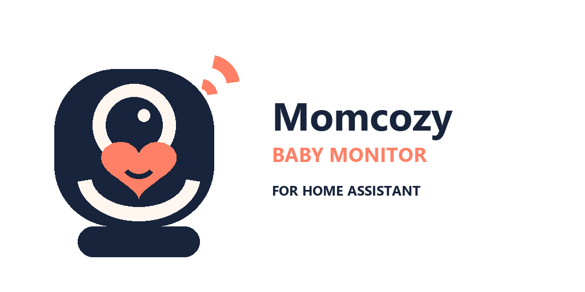

<div align="center">
  <picture>
    <source media="(prefers-color-scheme: dark)" srcset="custom_components/momcozy_baby_monitor/brand/dark_logo@2x.png">
    
  </picture>

  <p><strong>Bring your Momcozy BM04 into Home Assistant with the account you already use.</strong></p>
  <p>No ADB, APK, device reset, local-key extraction, or Smart Life account required.</p>
</div>

<p align="center">
  <a href="https://github.com/nmehlei/ha-momcozy-baby-monitor/releases/latest"></a>
  <a href="https://github.com/nmehlei/ha-momcozy-baby-monitor/actions/workflows/ci.yml"></a>
  <a href="https://www.home-assistant.io/"></a>
  <a href="https://hacs.xyz/"></a>
  <a href="LICENSE"></a>
</p>

> [!IMPORTANT]
> The BM04 allows **one live-video client at a time**. Keep **Keep connected**
> disabled (the default) if you want to move naturally between Home Assistant
> and the Momcozy app. See [Sharing the camera](#sharing-the-camera) below.

## What you get

| | Home Assistant entity | What it does |
|---|---|---|
| 📹 | **Camera** | Live video plus a cached snapshot for dashboards |
| 🏃 | **Motion** | Estimates motion from frames the integration already receives |
| 🔄 | **Retry connection** | Starts a fresh attempt after power or network recovery |
| ↩️ | **Release session** | Immediately gives the single video session back to the Momcozy app |

The integration discovers compatible cameras automatically and groups each
BM04 into one clean Home Assistant device.

## Install with HACS

<div align="center">

[](https://my.home-assistant.io/redirect/hacs_repository/?owner=nmehlei&repository=ha-momcozy-baby-monitor&category=integration)

</div>

1. Select the button above. If it does not open HACS, add
   `https://github.com/nmehlei/ha-momcozy-baby-monitor` under **HACS →
   Integrations → Custom repositories** and choose **Integration**.
2. Install **Momcozy Baby Monitor** in HACS.
3. Restart Home Assistant.
4. Go to **Settings → Devices & services → Add integration**.
5. Search for **Momcozy Baby Monitor** and sign in.

### What setup asks for

| Field | Enter |
|---|---|
| Email and password | The same Momcozy account used by the mobile app |
| Country code | The account's two-letter country code, such as `DE`, `BR`, or `US` |
| Region | The Tuya service region behind the account; Europe is the default |

Camera identifiers and local keys are discovered automatically. You never need
to copy them from the app.

## Sharing the camera

The BM04 serves one video client at a time. When Home Assistant owns the
session, the Momcozy app cannot display live video, and vice versa.

The defaults are designed for sharing:

- Home Assistant connects only when a live view is requested.
- It releases the session one minute after the last viewer leaves.
- Dashboard thumbnails use the most recent cached frame and do not wake an
  idle camera.
- **Release session** hands control back to the app immediately.

Enable **Keep connected** only when instant Home Assistant video matters more
than switching to the mobile app. Enable **Wake for snapshots** only when a
fresh thumbnail is worth claiming the camera session.

## Reliability and recovery

The integration supervises the stream and reconnects after transport failures,
stalls, camera restarts, network outages, and local-key rotation. Repeated
“busy” replies are slowed down rather than hammering the camera.

| Symptom | Try this |
|---|---|
| Home Assistant keeps loading the stream | Close live view in the Momcozy app, select **Release session**, then **Retry connection** |
| The Momcozy app cannot open video | Select **Release session** in Home Assistant and leave **Keep connected** off |
| Camera was unplugged or Wi-Fi returned | Wait for automatic recovery, or select **Retry connection** for an immediate attempt |
| Home Assistant reports that a power cycle is needed | Unplug the camera for a few seconds and reconnect it; the repair disappears after video recovers |
| No camera is discovered | Confirm the camera is online and that the country code and Tuya region match the Momcozy account |

When reporting a stream problem, download the integration diagnostics from the
device page. Credentials, account details, device identifiers, and local keys
are redacted automatically.

## Privacy and architecture

Momcozy authentication returns delegated Tuya credentials. The companion
[`tuya-ipc-p2p-sdk`](https://github.com/roquerodrigo/tuya-ipc-p2p-sdk)
handles Tuya gateway login, MQTT signalling, and encrypted relay transport,
then gives JPEG frames to this integration. Home Assistant previews use those
frames directly; consumers that require H.264 receive a loopback MPEG-TS
stream encoded by Home Assistant's ffmpeg installation.

Video is therefore **cloud coordinated and not fully local**. Home Assistant
stores the Momcozy password in config-entry storage so it can reconnect after
a restart. The integration never logs the password and redacts credentials and
keys from diagnostics.

The release pins the SDK to an immutable commit in the maintainer's public fork
while the [upstream pull request](https://github.com/roquerodrigo/tuya-ipc-p2p-sdk/pull/14)
is reviewed. Every installation therefore receives the exact revision tested
by this project rather than a moving branch.

<details>
<summary><strong>Developer setup</strong></summary>

```bash
scripts/setup
scripts/lint
```

The lint command runs Ruff, strict mypy, and the full pytest suite with a 90%
coverage requirement. See [CONTRIBUTING.md](CONTRIBUTING.md) for the workflow,
[SECURITY.md](SECURITY.md) for private vulnerability reports, and
[NOTICE](NOTICE) for upstream attribution.

</details>

## Project status and safety

This is an early, community-built integration focused on the **Momcozy BM04**.
Other Momcozy models are not assumed compatible. Bug reports and successful
model confirmations are welcome in [GitHub Issues](https://github.com/nmehlei/ha-momcozy-baby-monitor/issues).

> [!WARNING]
> This project is not a medical or safety device and is not a substitute for
> direct supervision. Do not make it the only way a child is monitored.

This project is unofficial and is not affiliated with, endorsed by, or
supported by Momcozy or Tuya. Momcozy and BM04 are trademarks of their
respective owners and are used only to identify compatible hardware.

Licensed under the [MIT License](LICENSE).
